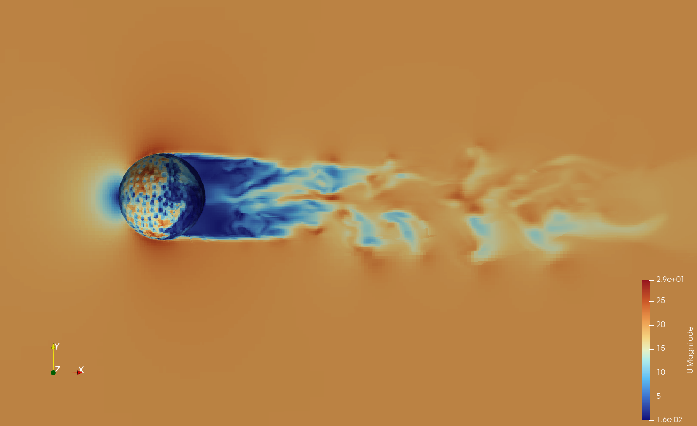

# Results of Hybrid URANS/LES approach aka Detached Eddy Simulation with k-OmegaSSTDES model

## Model behavior comparison on the same grid 

## Dimpled ball aka "Golfball"

Dimples and surface roughness counterintuitively provides turbulence patterns, and wake formation that results in drag reduction.
The results help illustrate how surface features influence aerodynamic performance.

## Intake manifolds for Carburator

The trumpet-shaped geometry guides airflow to optimize velocity distribution and minimize pressure losses.
This results help demonstrate how manifold design directly affects engine efficiency by controlling flow separation and improving air-fuel mixing.

